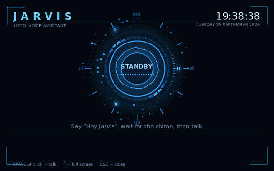

# My Jarvis (Windows)

A voice assistant that runs 100% on your own Windows PC. Free, private, no API keys, no monthly fees.



| Part  | What it does                                        | Made with                                   |
|-------|-----------------------------------------------------|---------------------------------------------|
| Ears  | turns your speech into text                         | faster-whisper (runs locally)               |
| Brain | understands you and decides what to do              | Ollama + llama3.2 (runs locally)            |
| Hands | does things: time, weather, web, notes, smart home  | small Python functions ("tools")            |
| Voice | reads the answer out loud                           | the voices built into Windows               |

## Files

| File              | Purpose                                              |
|-------------------|------------------------------------------------------|
| requirements.txt  | the Python packages to install                       |
| step1_speak.py    | test: your PC talks                                  |
| step2_listen.py   | test: your PC understands what you say               |
| step3_brain.py    | test: chat with the local AI model by typing         |
| jarvis.py         | the real thing: ears + brain + hands + voice         |
| step4_wakeword.py | test: Jarvis reacts to its name, "Hey Jarvis"        |
| jarvis_hud.py     | a face for Jarvis: a window that shows what it hears and says |

## Quick start (Windows 10 or 11)

1. Install Python 3.11 (tick "Add python.exe to PATH"), then Ollama, then run `ollama pull llama3.2`.
2. Open this folder in Visual Studio Code, open a terminal (Terminal > New Terminal) and run:

   ```
   py -3.11 -m venv .venv
   .venv\Scripts\activate
   pip install -r requirements.txt
   ```

   If PowerShell says "running scripts is disabled", run this once and try the activate line again:
   `Set-ExecutionPolicy -Scope CurrentUser RemoteSigned`

3. Run the steps in order: `python step1_speak.py`, `python step2_listen.py`, `python step3_brain.py`, then `python jarvis.py`.
4. Optional extras, in this order: hands-free (below), then the face (below).

If Jarvis never hears you: Settings > Privacy & security > Microphone > allow desktop apps to access your microphone.

## Settings

All settings are at the top of `jarvis.py`: the model, the voice, the language, the microphone sensitivity, the wake word, and the optional Home Assistant connection.

**Want a movie-style voice?** Set `VOICE_ENGINE = "edge"` (in `jarvis.py`, and in `step1_speak.py` to test it). That uses Microsoft's natural neural voices; the default `en-GB-RyanNeural` is a calm British male, `en-GB-ThomasNeural` is another good one. It needs an internet connection; if there is none, Jarvis falls back to the Windows voice automatically. `edge-tts` and `pygame` are installed by `requirements.txt`.

## Hands-free: say "Hey Jarvis" instead of pressing Enter

1. Install one more package (inside the activated `.venv`): `pip install openwakeword`
2. Test it: `python step4_wakeword.py`, say "Hey Jarvis" and watch the score bar jump. Ctrl+C to quit.
3. In `jarvis.py` change `WAKE_WORD = False` to `WAKE_WORD = True` and run `python jarvis.py` again.

Now Jarvis waits quietly. Say "Hey Jarvis", wait for the short chime, then talk. After each answer it keeps listening
for `FOLLOW_UP_SECONDS` (8 by default), so you can carry on the conversation without repeating the name. Say "goodbye"
to end a conversation and "shut down" (or press Ctrl+C) to close Jarvis. Too many false alarms? Raise
`WAKE_SENSITIVITY` to 0.6 or 0.7. Does it miss you? Lower it to 0.4.

The wake-word detection comes from the open-source openWakeWord project and runs fully on your PC. Its ready-made
"hey jarvis" model is free for personal, non-commercial use (CC BY-NC-SA 4.0).

## A face: the HUD window

Run `python jarvis_hud.py` instead of `python jarvis.py`. A window opens with a glowing reactor core that breathes while
Jarvis waits, fires a shockwave and sonar rings while it listens (the core swells with your voice), turns amber while it
thinks and sends out sound waves while it speaks, with the reply lighting up word by word as it is read out. Around it:
rotating rings, drifting particles, a clock, and read-outs of the brain, ears and voice in use. Press Space (or click) to talk, F for full screen, Esc to close. With
`WAKE_WORD = True` in `jarvis.py` the window is hands-free too. All your settings and tools carry over, because the
window simply runs `jarvis.py` underneath. Window size, colours and an always-on-top option are at the top of `jarvis_hud.py`.

## Add your own tool

Three moves, all inside `jarvis.py`. Example: a tool that reads back your saved notes.

1. Write a small Python function in the HANDS section:

   ```python
   def read_notes() -> str:
       try:
           with open("notes.txt", encoding="utf-8") as file:
               return file.read()[-1500:] or "There are no notes yet."
       except FileNotFoundError:
           return "There are no notes yet."
   ```

2. Add it to the `TOOL_FUNCTIONS` dictionary:

   ```python
   "read_notes": read_notes,
   ```

3. Add one line to the `TOOLS` list describing it in plain English:

   ```python
   tool("read_notes", "Read back the notes the user saved earlier. Use when the user asks what their notes are or to read their notes."),
   ```

Restart Jarvis and say "What are my notes?". The brain reads the description and starts using your tool when it makes sense.
Tools with inputs work the same way: give the function a parameter and describe it in the `tool(...)` line, exactly like `get_weather` does with `city`.
